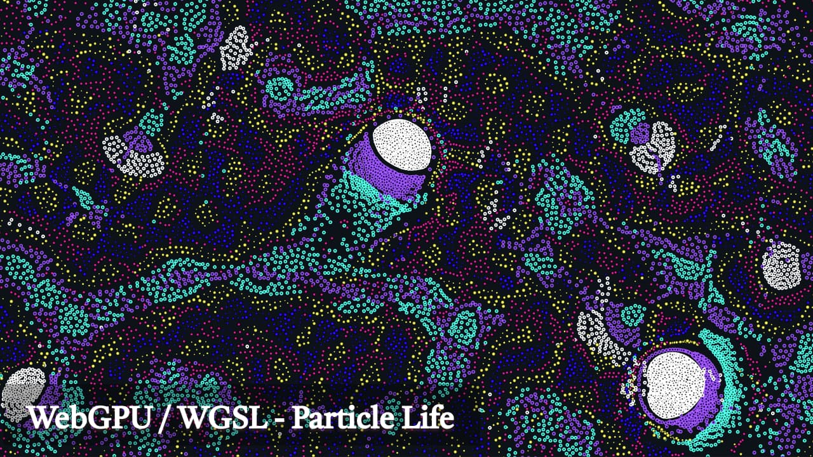

# Particle Life - WebGPU/WGSL

[](https://www.styublog.com/shader/particle-life)
[](https://youtu.be/wZq1vvrw90Y?si=yvt6Re6rliepYDJV)

<a href="https://youtu.be/wZq1vvrw90Y?si=yvt6Re6rliepYDJV" target="_blank">
  
</a>

WebGPUとWGSL（WebGPU Shading Language）を使用して実装されたParticle Lifeシミュレーションです。複数の粒子タイプが相互作用し、複雑で美しいパターンを生成します。

## 概要

Particle Lifeは、異なる種類の粒子が互いに力を及ぼし合うことで、生命のような複雑な行動パターンが現れるシミュレーションです。この実装では、WebGPUのコンピュートシェーダーを使用してGPU上で高速に計算を行い、リアルタイムで美しいアニメーションを生成します。

## 特徴

- **WebGPU対応**: 最新のWebGPU APIを使用した高性能なGPU計算
- **WGSLシェーダー**: WebGPU Shading Languageで書かれたカスタムシェーダー
- **リアルタイムシミュレーション**: 数千の粒子をリアルタイムで計算
- **インタラクティブ**: マウス操作やパラメータ調整が可能
- **美しいビジュアル**: グロー効果やカラーパレットによる視覚的表現

## 技術スタック

- **WebGPU**: GPU計算とレンダリング
- **WGSL**: シェーダープログラミング
- **TypeScript**: メインアプリケーション
- **Vite**: ビルドツール
- **lil-gui**: パラメータ調整UI

## セットアップ

```bash
# 依存関係のインストール
npm install

# 開発サーバーの起動
npm run dev

# ビルド
npm run build

# プレビュー
npm run preview
```

## プロジェクト構造

```
src/
├── shaders/           # WGSLシェーダーファイル
│   ├── particle.wgsl     # パーティクルレンダリング
│   ├── forceAccumulation.wgsl  # 力の計算
│   └── integrate.wgsl    # 位置・速度の更新
├── compute/           # コンピュートシェーダー管理
├── gfx/              # グラフィックス関連
├── utils/            # ユーティリティ
└── core/             # コアシステム
```

## デモ

- **ライブデモ**: <a href="https://www.styublog.com/shader/particle-life" target="_blank">https://www.styublog.com/shader/particle-life</a>
- **動画解説**: <a href="https://youtu.be/wZq1vvrw90Y?si=yvt6Re6rliepYDJV" target="_blank">YouTube</a>

